# Диаграммы архитектуры

> Визуальное представление архитектуры Pristine Framework

## 📋 Содержание

- [Общая архитектура](#общая-архитектура)
- [Доменный слой](#доменный-слой)
- [Поток данных](#поток-данных)
- [Жизненный цикл запроса](#жизненный-цикл-запроса)
- [Система событий](#система-событий)
- [Структура проекта](#структура-проекта)

---

## 🏗️ Общая архитектура

### Clean Architecture слои

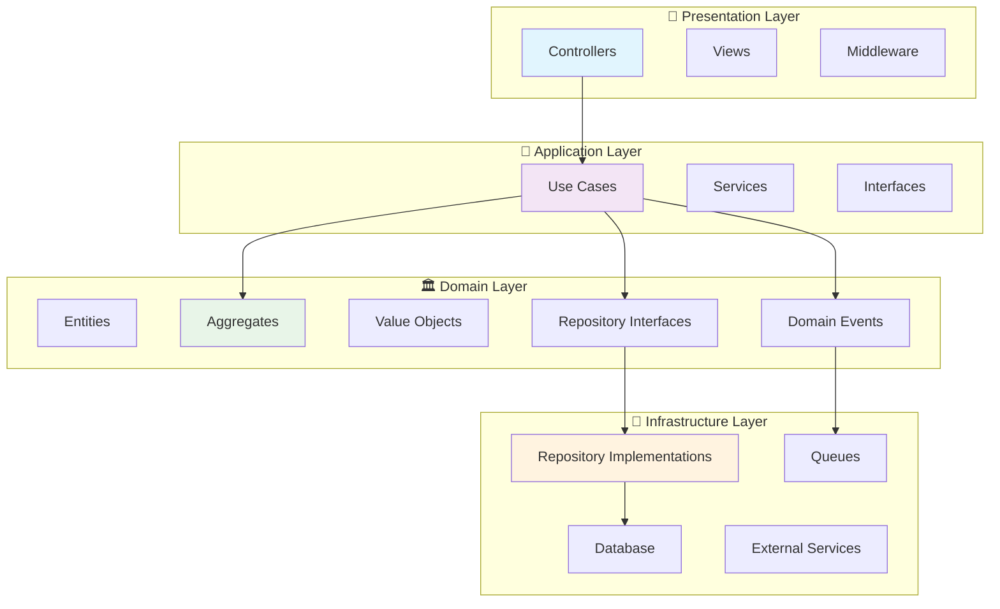

### Зависимости между слоями

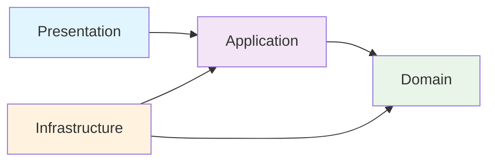

## 🏛️ Доменный слой

### Структура доменных объектов

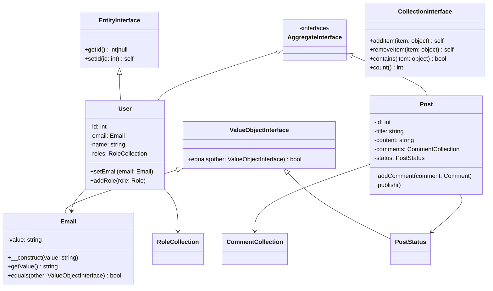

### Value Objects иерархия

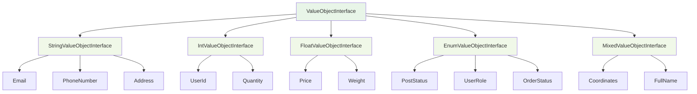

## 🔄 Поток данных

### Типичный запрос

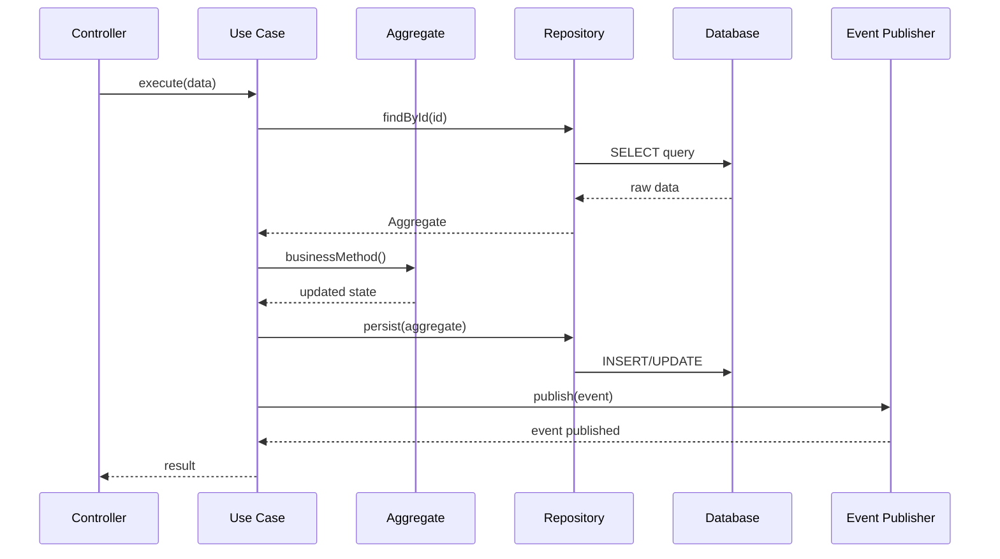

### CRUD операции

```mermaid
graph TD
    subgraph "Create"
        C1[Controller] --> UC1[CreateUseCase]
        UC1 --> VAL1[Validation]
        VAL1 --> AGG1[Create Aggregate]
        AGG1 --> REP1[Repository.persist]
        REP1 --> EVT1[Publish Event]
    end
    
    subgraph "Read"
        C2[Controller] --> UC2[ReadUseCase]
        UC2 --> REP2[Repository.find]
        REP2 --> MAP2[Map to DTO]
    end
    
    subgraph "Update"
        C3[Controller] --> UC3[UpdateUseCase]
        UC3 --> REP3[Repository.find]
        REP3 --> UPD3[Update Aggregate]
        UPD3 --> REP4[Repository.persist]
        REP4 --> EVT3[Publish Event]
    end
    
    subgraph "Delete"
        C4[Controller] --> UC4[DeleteUseCase]
        UC4 --> REP5[Repository.find]
        REP5 --> VAL4[Validate Deletion]
        VAL4 --> REP6[Repository.delete]
        REP6 --> EVT4[Publish Event]
    end
```

## 🚀 Жизненный цикл запроса

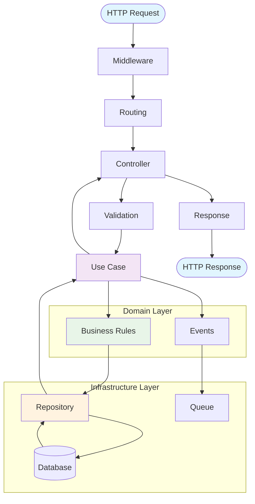

## 🔔 Система событий

### Event-Driven архитектура

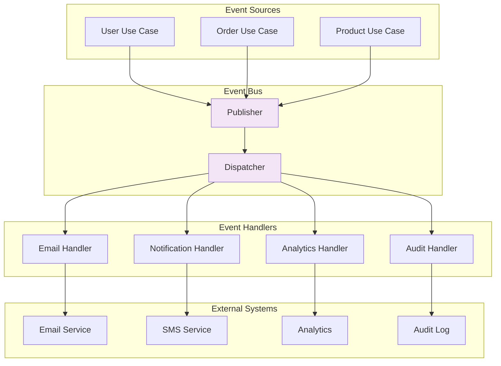

### Асинхронная обработка

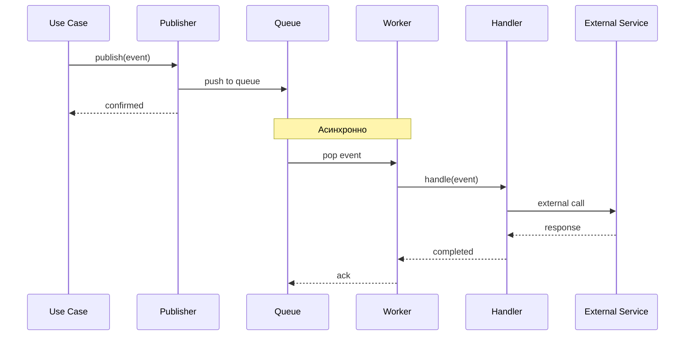

## 📁 Структура проекта

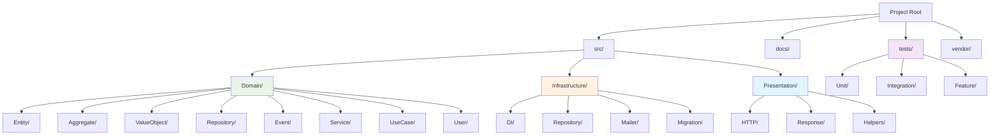

## 🔗 Взаимодействие компонентов

### Dependency Injection

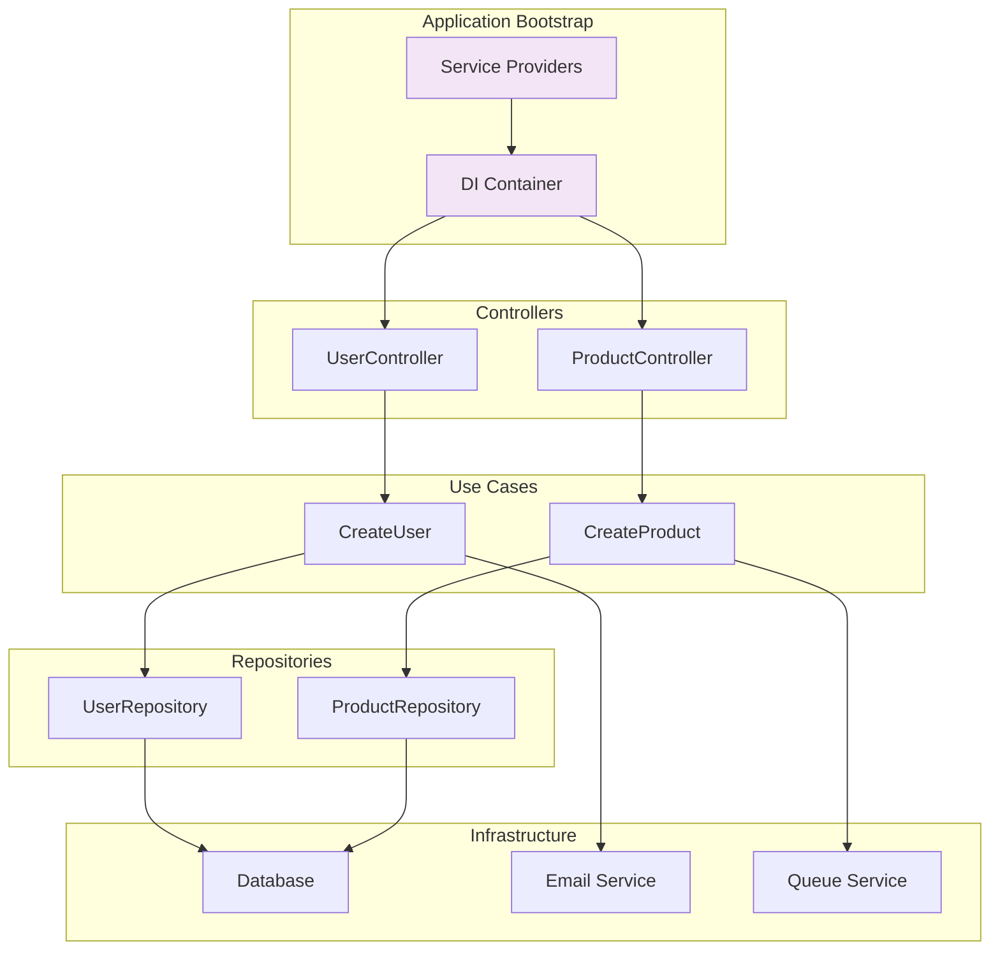

### Repository Pattern

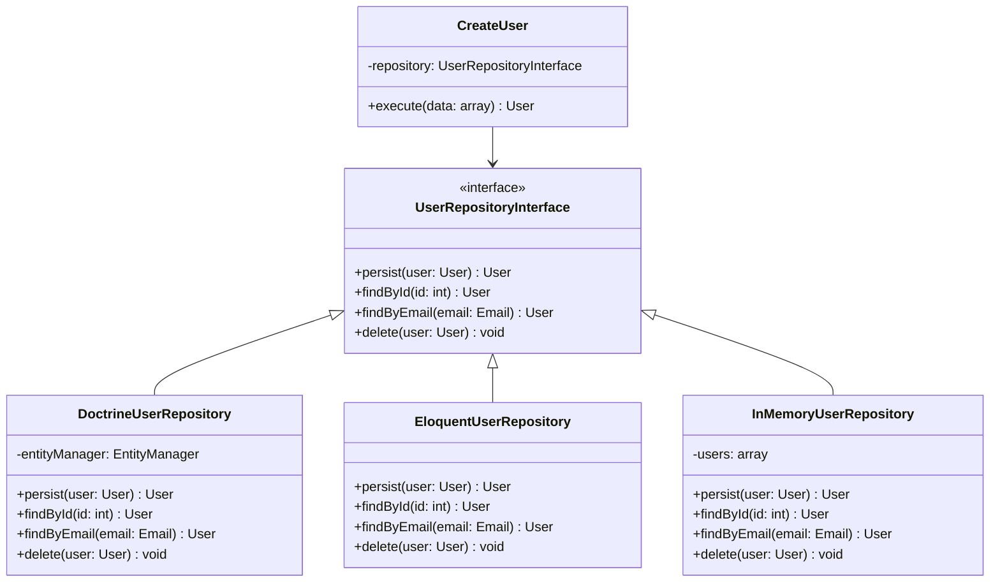

---

## 📊 Диаграммы для копирования

Все диаграммы выше написаны в формате Mermaid и могут быть легко вставлены в:

- **GitHub/GitLab README** - поддерживают Mermaid нативно
- **Notion** - через блок Mermaid
- **Obsidian** - с плагином Mermaid
- **VS Code** - с расширением Mermaid Preview

### Пример использования в Markdown:

```markdown
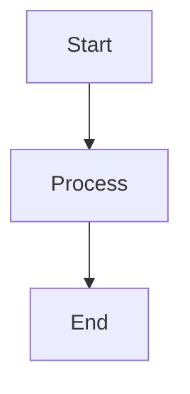

### Интерактивные диаграммы

Для более интерактивного опыта можно использовать:

1. **Mermaid Live Editor**: https://mermaid.live/
2. **Draw.io**: https://app.diagrams.net/
3. **PlantUML**: https://plantuml.com/

### Экспорт в другие форматы

```bash
# Установка Mermaid CLI
npm install -g @mermaid-js/mermaid-cli

# Экспорт в PNG
mmdc -i diagram.mmd -o diagram.png

# Экспорт в SVG
mmdc -i diagram.mmd -o diagram.svg

# Экспорт в PDF
mmdc -i diagram.mmd -o diagram.pdf
```
