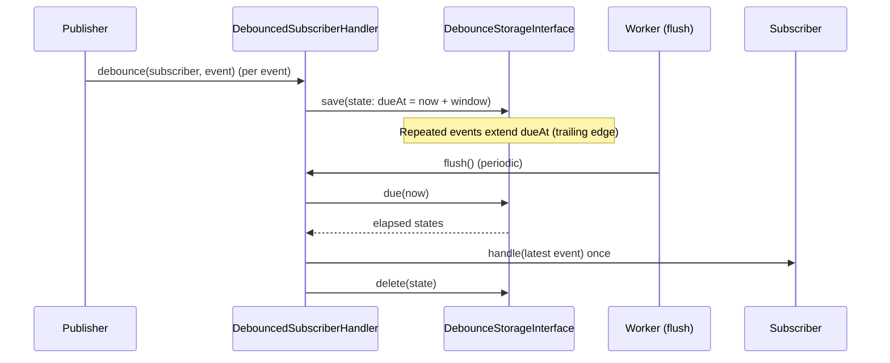

# Debounced Subscribers (Domain layer)

> Coalesce bursts of domain events into a single, deferred subscriber invocation.

Namespace: `Domain\Event` (interfaces, handler) and `Infrastructure\Event\Debounce`
(storage backends).

## Problem

In event-driven systems some events fire in rapid succession (e.g. a batch
operation updating a notification badge count). Handling every single event is
wasteful — the UI only needs the final result. A **debounced subscriber** runs
once after a short quiet period, instead of once per event.

Because PHP requests are independent processes, debouncing state is kept in
**shared storage** (files, Redis, or Memcached) so coalescing works across
requests.

## How it works



1. During `Publisher::publish()`, a `DebouncedSubscriberInterface` subscriber is
   routed to the `DebounceHandlerInterface` instead of being invoked directly.
2. Each matching event extends the bucket's due time to `now + window`
   (trailing-edge debounce). The same bucket keeps its original "first seen" time.
3. A worker or scheduled task calls `DebouncedSubscriberHandler::flush()`
   periodically. Buckets whose window has elapsed are handled **once** and cleared.

If no `DebounceHandlerInterface` is configured on the Publisher, debounced
subscribers fall back to **synchronous** handling (backward compatible).

## The interface

Implement `Domain\Event\DebouncedSubscriberInterface`:

```php
use Domain\Event\DebouncedSubscriberInterface;
use Domain\Event\EventInterface;

class BadgeCountSubscriber implements DebouncedSubscriberInterface
{
    public function handle(EventInterface $event): void
    {
        // Runs once after the burst settles.
        // Recompute and push the badge count here.
    }

    public function isSubscribedTo(EventInterface $event): bool
    {
        return $event instanceof BadgeChangedEvent;
    }

    /** Events sharing this key are coalesced (here: one bucket per user). */
    public function getDebounceKey(EventInterface $event): string
    {
        /** @var BadgeChangedEvent $event */
        return 'badge:' . $event->getUserId();
    }

    /** Fire once no matching event was seen for this long. */
    public function getDebounceMilliseconds(): int
    {
        return 2000; // 2 seconds of silence
    }

    /** Never defer longer than this during a continuous burst (0 = no cap). */
    public function getMaxWaitMilliseconds(): int
    {
        return 10000; // hard ceiling of 10 seconds
    }
}
```

| Method | Purpose |
| --- | --- |
| `getDebounceKey(EventInterface): string` | Bucket identifier; events with the same key are coalesced. Keep it stable and low-cardinality. Namespaced by subscriber class internally. |
| `getDebounceMilliseconds(): int` | Trailing-edge quiet window. Must be `> 0`. |
| `getMaxWaitMilliseconds(): int` | Maximum total deferral during an unending burst (`0` = no cap). Prevents starvation. |

## Wiring the Publisher

```php
use Domain\Event\DebouncedSubscriberHandler;
use Domain\Event\Publisher;
use Infrastructure\Event\Debounce\DebounceStorageFactory;

$storage = DebounceStorageFactory::fromEnv();   // backend chosen via .env
$handler = new DebouncedSubscriberHandler($storage);

$publisher = Publisher::getInstance();
$publisher->setDebounceHandler($handler);
$publisher->subscribe(new BadgeCountSubscriber());
```

## Flushing (running deferred work)

`flush()` performs the deferred invocations. Run it periodically from a
long-running worker or a scheduled task (e.g. every second):

```php
$storage = DebounceStorageFactory::fromEnv();
$handler = new DebouncedSubscriberHandler($storage);

while (true) {
    $handler->flush();   // invokes due subscribers once, clears their state
    usleep(500_000);     // 0.5s
}
```

`flush()` returns the number of subscribers invoked. Each due bucket is re-read
immediately before invocation, so a window extended by a concurrent event is
respected (the bucket is flushed on a later run).

### Reconstructing subscribers

By default `flush()` instantiates the subscriber via its no-argument constructor.
For subscribers that need dependencies, pass a resolver:

```php
$handler = new DebouncedSubscriberHandler(
    $storage,
    subscriberResolver: fn(string $class) => $container->get($class),
);
```

A custom clock can also be injected as the third argument for testing.

## Storage configuration (`.env`)

The backend is selected by `EVENT_DEBOUNCE_STORAGE`. `DebounceStorageFactory::fromEnv()`
reads the following variables:

```dotenv
# file (default) | redis | memcached
EVENT_DEBOUNCE_STORAGE=file

# --- file driver ---
# Defaults to <system temp>/event-debounce
EVENT_DEBOUNCE_FILE_PATH=/var/run/app/debounce

# --- redis driver (requires ext-redis) ---
EVENT_DEBOUNCE_REDIS_HOST=127.0.0.1
EVENT_DEBOUNCE_REDIS_PORT=6379
EVENT_DEBOUNCE_REDIS_AUTH=
EVENT_DEBOUNCE_REDIS_PREFIX=debounce

# --- memcached driver (requires ext-memcached) ---
EVENT_DEBOUNCE_MEMCACHED_HOST=127.0.0.1
EVENT_DEBOUNCE_MEMCACHED_PORT=11211
EVENT_DEBOUNCE_MEMCACHED_PREFIX=debounce
```

| Backend | Class | Notes |
| --- | --- | --- |
| File | `Infrastructure\Event\Debounce\FileDebounceStorage` | No external service; atomic, locked writes. Recommended default. |
| Redis | `Infrastructure\Event\Debounce\RedisDebounceStorage` | Sorted-set index for efficient due scans. Durable. Requires `ext-redis`. |
| Memcached | `Infrastructure\Event\Debounce\MemcachedDebounceStorage` | Best-effort; the volatile cache may evict pending state under memory pressure. Requires `ext-memcached`. |

All backends implement `Domain\Event\DebounceStorageInterface`, so you can provide
a custom backend by implementing that interface directly.

## Caveats

- **A flush worker is required.** Without periodic `flush()` calls, deferred
  subscribers never run.
- **Memcached is volatile.** Prefer the file or Redis backends when losing an
  occasional coalesced invocation is unacceptable.
- **Avoid combining with async.** If a subscriber is both
  `DebouncedSubscriberInterface` and `AsyncSubscriberInterface`, debouncing takes
  precedence and the eventual `handle()` runs synchronously inside `flush()`.

## Related

- [Domain layer overview](../index.md)
- `Domain\Event\Publisher`, `Domain\Event\AsyncSubscriberInterface`,
  `Domain\Event\IndexedSubscriberInterface`
